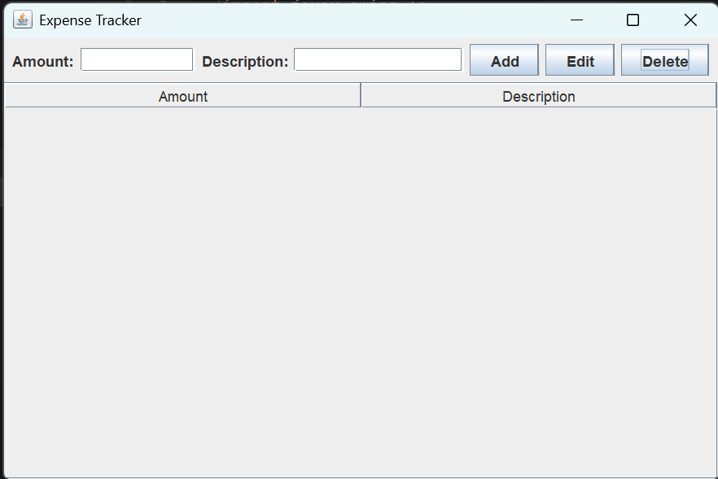
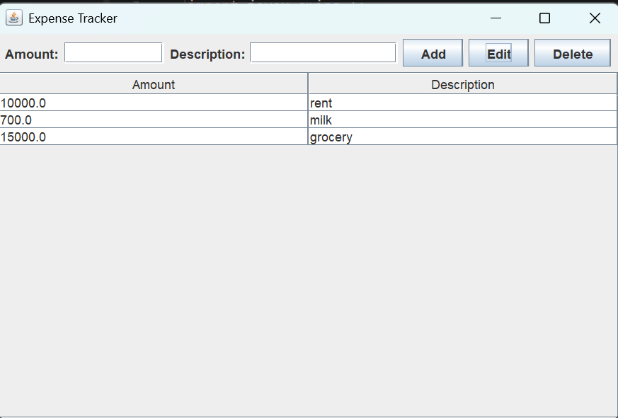

# 💰 Expense Tracker

**Expense Tracker** is a simple and user-friendly desktop application built using **Java Swing** that allows users to manage their expenses through a graphical user interface.

The application allows users to enter an expense amount and description, and provides options to add, edit, and delete expense records. All added expenses are displayed in a table for easy viewing and management.

---

## ✨ Features

* ➕ Add new expenses
* ✏️ Edit existing expenses
* 🗑️ Delete expenses
* 📋 Display expenses in a table
* 💵 Record expense amounts
* 📝 Add descriptions for expenses
* 💾 Save expense data using Java Serialization
* 📂 Load previously saved expense data
* 🖥️ Simple and user-friendly graphical interface

---

## 🛠️ Technologies Used

| Technology             | Purpose                                              |
| ---------------------- | ---------------------------------------------------- |
| **Java**               | Core programming language                            |
| **Java Swing**         | Building the graphical user interface                |
| **JTable**             | Displaying expense records                           |
| **JTextField**         | Taking amount and description input                  |
| **JButton**            | Providing Add, Edit, and Delete actions              |
| **Java Serialization** | Saving and loading expense data                      |
| **OOP**                | Organizing the application using classes and objects |

---

## ⚙️ How It Works

The application follows a simple process:

1. The user enters an **amount** and **description**.
2. The user clicks the **Add** button.
3. The expense is added to the expense table.
4. The user can select an existing expense to edit or delete it.
5. When **Edit** is selected, the expense details can be updated.
6. When **Delete** is selected, the selected expense is removed.
7. Expense data is stored using **Java Serialization**.

---

## 📋 Expense Details

The application displays expense information in a table:

| Field           | Description                        |
| --------------- | ---------------------------------- |
| **Amount**      | The amount spent on the expense    |
| **Description** | A short description of the expense |

### Example

|  Amount | Description |
| ------: | ----------- |
| 10000.0 | Rent        |
|   700.0 | Milk        |
| 15000.0 | Grocery     |

---

## 🖥️ Application Interface

The application provides:

* **Amount** input field
* **Description** input field
* **Add** button
* **Edit** button
* **Delete** button
* **Expense table**

---

## 📸 Project Preview

### Empty Expense Tracker



### Expense Records



---

## 📂 Project Structure

```text
expenseTracker/
│
├── screenshots/
│   ├── expense-tracker-empty.png.png
│   └── expense-tracker-data.png.png
│
├── src/
│   └── expenseTracker/
│       └── ...
│
├── out/
│   └── production/
│       └── expenseTracker/
│
├── expenses.ser
└── README.md
```

---

## 🚀 How to Run

### Prerequisites

Make sure you have:

* **Java JDK** installed
* A Java IDE such as **IntelliJ IDEA**, **Eclipse**, or **VS Code**

### Steps

1. Open the project in your preferred Java IDE.
2. Navigate to the Expense Tracker source files.
3. Locate the main Java class.
4. Run the application.
5. The **Expense Tracker** window will open.
6. Enter an amount and description to start managing expenses.

---

## 🧠 What I Learned

While building this project, I practiced:

* Creating GUI applications using Java Swing
* Working with `JFrame`
* Using `JTable` to display data
* Working with `JTextField` and `JButton`
* Handling button click events
* Using Action Listeners
* Implementing basic CRUD operations
* Working with classes and objects
* Applying Object-Oriented Programming concepts
* Using Java Serialization for data persistence
* Managing user input and application data

---

## 🔮 Future Improvements

Some improvements that could be added in the future:

* 💰 Add total expense calculation
* 📅 Add dates to expenses
* 🗂️ Add expense categories
* 🔍 Add search and filtering
* 📊 Add expense statistics and charts
* 📅 Add monthly and yearly expense summaries
* 🎨 Improve the overall UI/UX
* 💾 Add database support
* 📤 Add expense data export functionality

---

## 🤝 Contributing

Suggestions and improvements are welcome.

If you find a bug or have an idea for improving the project, feel free to open an **Issue** or submit a **Pull Request**.

---

## 📄 License

This project was created for **learning and educational purposes**.
